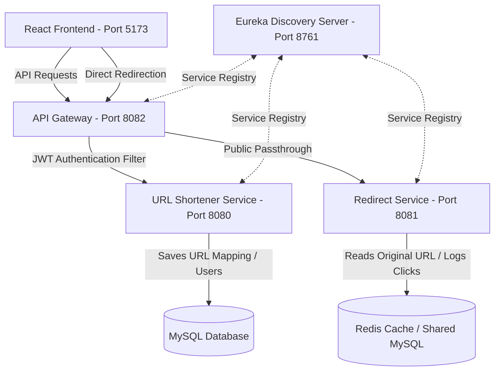

# ShortUrl — High-Performance URL Shortener Microservices

ShortUrl is an enterprise-grade, high-performance, and secure URL shortening and analytics platform. It is engineered with a modern microservices architecture using Spring Boot (Spring Cloud, Eureka Discovery, API Gateway) and a React frontend styled with Tailwind CSS v4.

---

## 🚀 Key Features

*   **Fast Shortening Engine**: Convert long URLs into compact 6-character unique codes instantly.
*   **Secure JWT Authentication**: Full registration and sign-in flow utilizing BCrypt password hashing and JWT token issuance.
*   **Dynamic Analytics**: Track click counts for every generated link in real time.
*   **User Dashboard**: Clean data table to view url history, copy short links with a single click, or delete unwanted redirections.
*   **Theme Switcher**: Fluid dark/light theme switching with stored state persistence.
*   **Modern Info Overlays**: Interactive modals for API documentation, system architecture charts, payment checkout simulation, support forms, and FAQ guides.
*   **Resilient Redirection Cache**: Designed to separate redirection traffic from core data mutation pipelines, allowing maximum throughput.

---

## 📸 Screenshots

| Landing Page (Light Mode) | Dashboard (Dark Mode) |
| --- | --- |
|  |  |

| JWT Authentication Modal | Sign Up Form |
| --- | --- |
|  |  |

| Pricing Page | Link Analytics Lookup |
| --- | --- |
|  |  |

---

## 🛠️ Tech Stack

### Frontend
*   **React 19** & **Vite 8**
*   **Tailwind CSS v4** (Utility styling)
*   **React Router v7** (Routing)
*   **Lucide React** (Vector iconography)

### Backend (Spring Boot Microservices)
*   **Spring Boot 3.x**
*   **Spring Cloud Netflix Eureka** (Service Discovery)
*   **Spring Cloud Gateway WebMVC** (API Routing)
*   **Spring Data JPA** (Hibernate ORM)
*   **Spring Security Crypto** (BCrypt)
*   **JJWT (Java JWT)** (Token validation/issuance)
*   **MySQL & Redis Cache**

---

## 🏗️ System Architecture

ShortUrl distributes request processing across multiple microservices to optimize data storage, security boundaries, and cache redirection latency.



---

## 🔌 API Endpoints

All client requests route through the **API Gateway (Port 8082)**.

### Authentication Endpoints (Public)
*   `POST /auth/register`: Create a new user account.
    ```json
    { "username": "example", "password": "securepassword" }
    ```
*   `POST /auth/login`: Authenticate and receive a JWT.
    ```json
    { "username": "example", "password": "securepassword" }
    ```
    *Returns:*
    ```json
    {
      "token": "eyJhbGciOi...",
      "username": "example",
      "message": "Login successful"
    }
    ```

### URL Operations (Secured/Public)
*   `POST /api/v1/shorten` (Public/Authorized): Generate a short link. Supply a `Authorization: Bearer <token>` header to map the link to your history.
    ```json
    { "longUrl": "https://example.com/very-long-link-to-be-shortened" }
    ```
    *Returns:*
    ```json
    { "shortUrl": "http://localhost:8082/xyzabc" }
    ```
*   `GET /api/v1/history` (Authorized): Retrieve the authenticated user's shortening history.
*   `DELETE /api/v1/delete/{shortCode}` (Authorized): Remove a shortened URL mapping.

### Redirection Endpoint (Public)
*   `GET /{shortCode}`: Performs a HTTP 302 redirection to the original destination and logs analytics click counters.

---

## 💻 Running Locally

### Prerequisites
*   Java 21 JDK
*   Node.js (v18+)
*   MySQL Instance running at `localhost:3306` with database `url_shortener` (Password: `root`, Username: `root`)

### 1. Launch Backend Services
Start the services in the following order:
1.  **Discovery Service** (Port 8761)
2.  **API Gateway** (Port 8082)
3.  **URL Shortener Service** (Port 8080)
4.  **Redirecting Service** (Port 8081)

Run this command inside each service directory:
```bash
./mvnw spring-boot:run
```

### 2. Start Frontend App
From the `Frontend` directory, run:
```bash
npm install
npm run dev
```
Open [http://localhost:5173](http://localhost:5173) in your web browser.

---

## 📜 License

Distributed under the MIT License. See `LICENSE` for more information.

---

*Developed by [Shivansh](https://github.com/shivanshmishra54) — Connect on [LinkedIn](https://www.linkedin.com/in/shivansh-mishra54/)*
